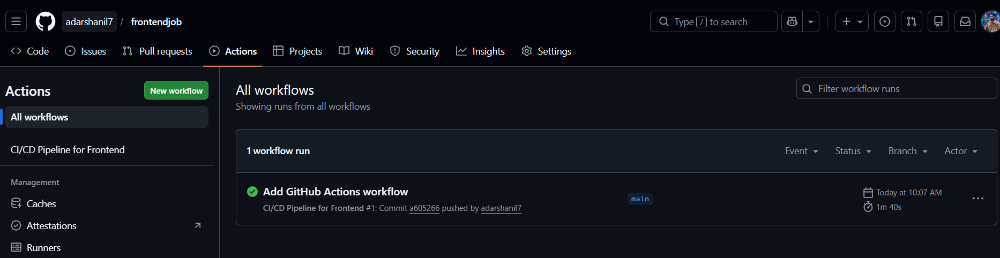
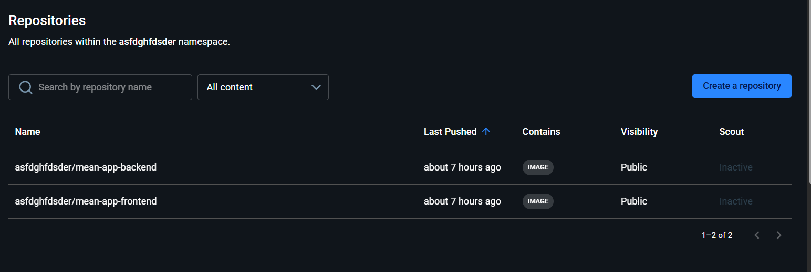
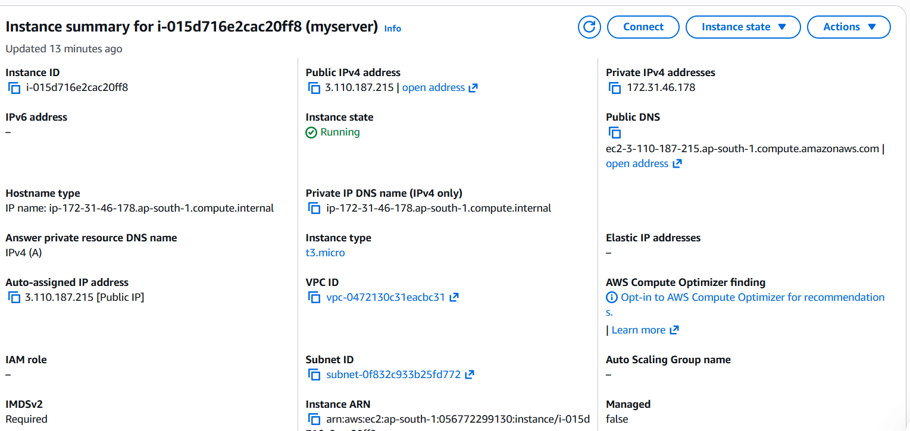

# MEAN Stack Application Deployment

This project contains a full-stack CRUD application using the MEAN stack (MongoDB, Express, Angular, and Node.js) that has been fully containerized and automatically deployed to an AWS EC2 instance using a GitHub Actions CI/CD pipeline.

## 🏗️ Architecture & Repositories
For CI/CD best practices, the monolithic application was separated into two distinct repositories:
1. **Frontend Repository:** [Link to your frontend repo here]
2. **Backend Repository:** [Link to your backend repo here]

Both repositories contain their respective `Dockerfile` and `.github/workflows/deploy.yml` pipeline files.

---

## 🚀 Step-by-Step Deployment Instructions

### 1. AWS EC2 Cloud Setup
1. Launch an **Ubuntu 22.04 LTS** virtual machine on AWS EC2.
2. Download the `.pem` key for SSH access.
3. In the AWS EC2 Console, configure the **Security Group** (Inbound Rules) to allow:
   - **SSH (Port 22)** from your IP
   - **HTTP (Port 80)** from Anywhere-IPv4 (`0.0.0.0/0`)

### 2. Server Configuration
SSH into the EC2 instance and install Docker and Docker Compose:
```bash
sudo apt update -y
sudo apt install docker.io -y
sudo curl -L "https://github.com/docker/compose/releases/latest/download/docker-compose-$(uname -s)-$(uname -m)" -o /usr/local/bin/docker-compose
sudo chmod +x /usr/local/bin/docker-compose
sudo usermod -aG docker ubuntu
```
Create an application directory and add the `docker-compose.yml` and `nginx.conf` files.

### 3. GitHub Actions CI/CD Configuration
In both the frontend and backend GitHub repositories, navigate to **Settings > Secrets and variables > Actions** and add the following repository secrets:
- `DOCKER_USERNAME`: Docker Hub Username
- `DOCKER_PASSWORD`: Docker Hub Access Token
- `VM_HOST`: AWS EC2 Public IPv4 Address
- `VM_USERNAME`: `ubuntu`
- `VM_SSH_KEY`: The entire contents of your downloaded `.pem` key file.

### 4. Continuous Deployment
Whenever code is pushed to the `main` branch, the GitHub Actions pipeline will:
1. Log into Docker Hub.
2. Build the new Docker image based on the repository's `Dockerfile`.
3. Push the tagged image to Docker Hub.
4. SSH into the AWS EC2 server.
5. Pull the latest compiled images and restart the `docker-compose` stack without downtime.

---

## 📸 Deliverables & Screenshots

### 1. CI/CD Configuration & Execution

### 2. Docker Image Build & Push


### 3. Application Deployment & Working UI


### 4. Nginx Setup & Infrastructure
